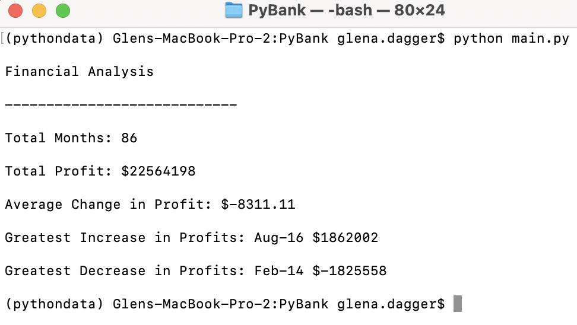
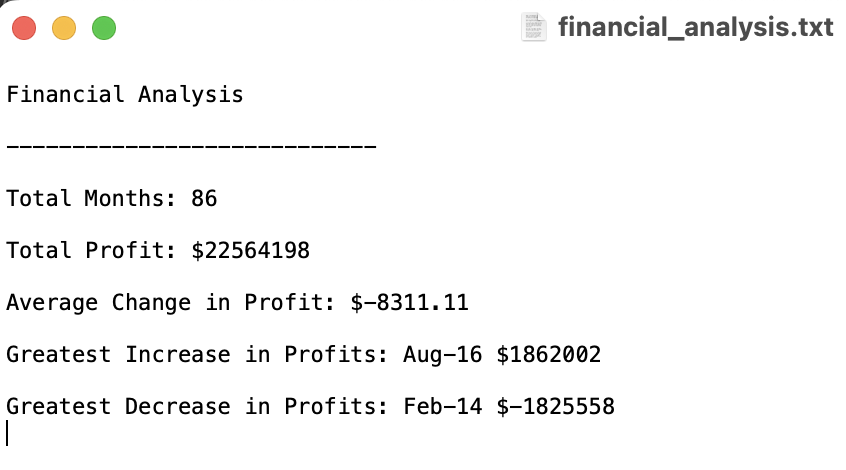

# Python-Challenge

## Week 3 Assignment

### Glen Dagger

***

### PyBank

<t>
For this assignment, I wrote a Python script that analyzed the financial records in the provided budget_data.csv file. This script successfully reads through the file and calculates the total number of months, net total amount of "Profits/Losses", changes in "Profit/Losses" and average of those changes, greatest increase in profits (date/amount), and greatest decrease in profits (date/amount) over the entire period. This script prints the financial analysis to the terminal and also exports the same analysis to a new text file. 

In order to complete this script, I used the csv module to read and write file contents, the os module to specify their file paths, and demonstrated my knowledge of variables, lists/list comprehensions, dictionaries/dictionary comprehensions, print statements, detailed commenting, and general Python syntax.

 

*Screenshot of terminal after running main.py*

*Screenshot of exported .txt file*

***

### PyPoll