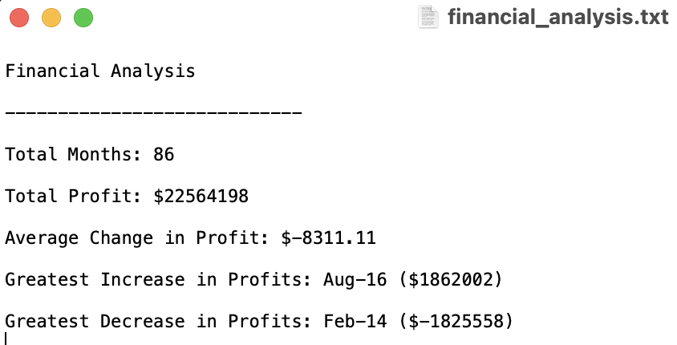

# Python-Challenge

## Week 3 Assignment

### Glen Dagger

***
### PyBank

For the PyBank portion of the assignment, I wrote a Python script that analyzes the financial records in the provided budget_data.csv file. This script successfully reads through the file and calculates the total number of months, net total amount of "Profits/Losses", changes in "Profit/Losses" and average of those changes, greatest increase in profits (date/amount), and greatest decrease in profits (date/amount) over the entire period. This script prints the financial analysis to the terminal and also exports the same analysis to a new text file. 

In order to complete this script, I used the csv module to read and write file contents, the os module to specify their file paths, and demonstrated my knowledge of variables, lists/list comprehensions, dictionaries/dictionary comprehensions, print statements, detailed commenting, and general Python syntax. I learned how to write a dictionary comprehension while researching how to update values in a dictionary and streamlined my code. I initially calculated the max and min values by running a for loop within the csvreader loop to update max and min values if necessary. I realized I had mistakenly thought of "Profit/Losses" as the changes themselves, and had to go back to calculate the differences by making a new list. I then realized that I could use the max() and min() functions on that list to return my correct max_profit and min_profit values.

 

*Screenshot of terminal after running main.py*

*Screenshot of exported .txt file*

***
### PyPoll

For the PyPoll portion of the assignment, I wrote a Python script that analyzes the data in the provided election_data.csv file. This script successfully counts the total votes, number/percent of votes for each individual candidate, and determines the winner by popular votes. The election results are printed to the terminal and exported to a new text file.

<b>

*Screenshot of terminal after running main.py in /PyPoll/*

*Screenshot of exported .txt file*

