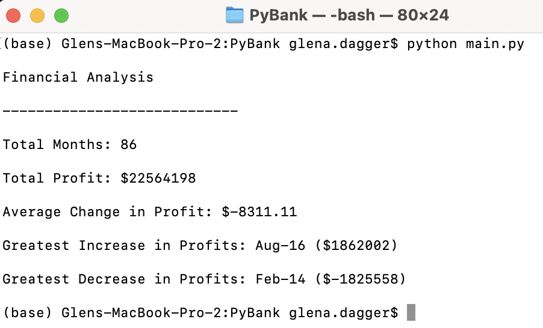

# Python-Challenge

## Week 3 Assignment

### Glen Dagger

***
### PyBank

For the PyBank portion of the assignment, I wrote a Python script that analyzes the financial records in the provided budget_data.csv file. This script successfully reads through the file and calculates the total number of months, net total amount of "Profits/Losses", changes in "Profit/Losses" and average of those changes, greatest increase in profits (date/amount), and greatest decrease in profits (date/amount) over the entire period. This script prints the financial analysis to the terminal and also exports the same analysis to a new text file. 

See below for screenshots of the terminal output and exported text file summary.

In order to complete this script, I used the csv module to read and write file contents, the os module to specify their file paths, and demonstrated my knowledge of variables, lists/list comprehensions, dictionaries/dictionary comprehensions, print statements, detailed commenting, and general Python syntax. I learned how to write a dictionary comprehension while researching how to update values in a dictionary and streamlined my code. I initially calculated the max and min values by running a for loop within the csvreader loop to update max and min values if necessary. I realized I had mistakenly thought of "Profit/Losses" as the changes themselves, and had to go back to calculate the differences by making a new list. I then realized that I could use the max() and min() functions on that list to return my correct max_profit and min_profit values much more succinctly.

 

*Screenshot of terminal after running main.py*

*Screenshot of exported .txt file*

***
### PyPoll

For the PyPoll portion of the assignment, I wrote a Python script that analyzes the data in the provided election_data.csv file. This script successfully counts the total votes, number/percent of votes for each individual candidate, and determines the winner by popular votes. The election results are printed to the terminal and exported to a new text file. 

In order to complete this script I used many of the same skills as in the PyBank portion. I could have used a dictionary again to more easily store candidate names along with their corresponding vote count values, but I decided to try something different for this portion. I needed to use the 'for loop' method of finding the winning number of votes since I needed to know the index in order to name and store the associated winning candidate. It was then very simple to write a list comprehension to create a list of vote percents for each candidate. I considered using the zip() function to combine them all into a single list, but since all I had to do at that point was print them, it was simpler to call the same index from each separate list for my final results. I also considered writing additional code to account for the case of a tie, in which case I would use an if/else statement to check if there were multiple max vote counts, and if so, print an alternate version of the results listing all candidates who tied. I opted not to add this code since I completed the requirements for the assignment but I am confident I would be able to accomplish this fairly easily. 

See below for screenshots of the terminal output and exported text file results.

<b>

*Screenshot of terminal after running main.py in /PyPoll/*

*Screenshot of exported .txt file*

